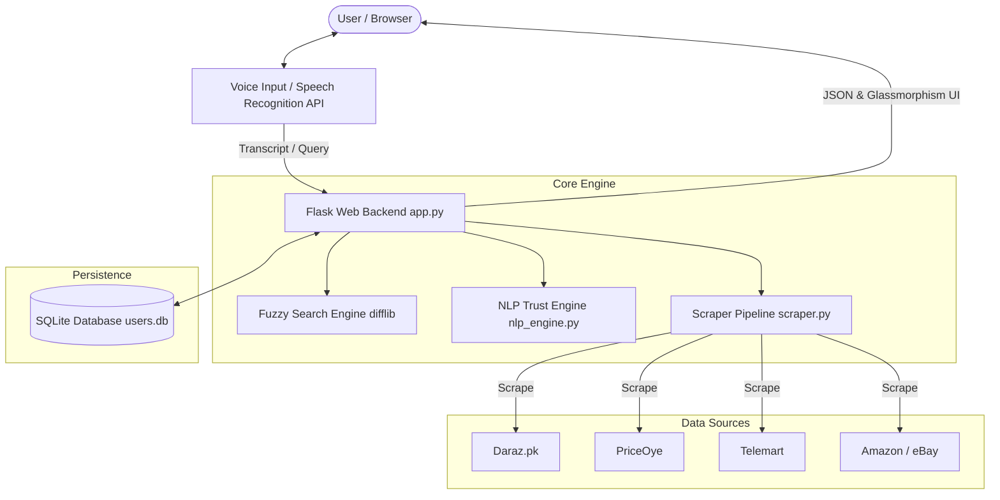

# 🛒 Smart Shopping — Multi-Source E-Commerce Aggregator & Comparison Engine


**Smart Shopping** is an intelligent, full-stack e-commerce aggregation and price comparison platform designed to help users find the best deals, evaluate merchant credibility, track price histories, and search via multi-accent voice input across 10+ major online marketplaces in Pakistan and globally.

---

## 🌟 Key Engineering Features

### 🎙️ Multi-Accent Voice Search & Fuzzy String Matching
- **Acoustic Phoneme & Locale Adaptation:** Integrated Web Speech API with dynamic browser locale detection (`navigator.language`) and multi-alternative evaluation (`maxAlternatives = 5`) to seamlessly adapt to diverse global accents (South Asian, Middle Eastern, Western).
- **Backend Fault Tolerance (Levenshtein Distance):** Powered by Python's `difflib` string distance algorithm. Even if voice transcription introduces accent-induced typos (e.g. `airburd` instead of `airpods`), the fuzzy search engine matches and displays the closest product suggestions.

### 🔍 Dynamic Real-Time Multi-Source Web Scraping
- Parallelized scraping across 10+ major retail platforms: **Daraz.pk, PriceOye, Telemart, Mega.pk, Surmawala, Ubuy, Shophive, Clicky, Amazon, eBay, Al-Fatah**.
- Server-side image proxying and request retry resilience to bypass CORS restrictions and hotlink blocks.

### 🛡️ Intelligent NLP Trust Score & Merchant Analysis
- Evaluates merchant credibility, review sentiment using `TextBlob`, price volatility, and warranty terms to generate a 0–100 **Trust Score** badge (*High Trust*, *Medium Trust*, *Needs Review*).

### 📈 Historical Price Tracking & Analytics
- Automated SQLite price logging per product search.
- Interactive Chart.js trend visualization for price volatility tracking and target price alert triggers.

### 💼 Admin Management & Affiliate Monetization Dashboard
- Real-time tracking of search volume trends over 7 days.
- Store redirect click logs and automatic affiliate commission calculation (3% revenue estimation).

---

## 🏗️ System Architecture



---

## 🛠️ Technology Stack

- **Backend:** Python 3, Flask, SQLite3, TextBlob NLP, Google Gemini AI (Optional Chatbot)
- **Scraping & Data Processing:** BeautifulSoup4, Requests, Concurrent Threading
- **Frontend:** HTML5, Vanilla CSS3 (Glassmorphism Dark/Light Theme System), Modern Vanilla JS
- **Voice Recognition:** Web Speech API with dynamic locale phoneme matching
- **Visualization:** Chart.js, FontAwesome Icons

---

## ⚡ Quick Start & Setup Guide

### 1. Clone Repository
```bash
git clone https://github.com/your-username/smart-shopping.git
cd smart-shopping
```

### 2. Install Dependencies
```bash
pip install -r requirements.txt
python -m textblob.download_corpora
```

### 3. Run Application
```bash
python app.py
```
Open your browser and navigate to `http://127.0.0.1:5000/`.

---

## 👨‍💻 Admin Credentials
- **URL:** `http://127.0.0.1:5000/admin-login`
- **Username:** `admin`
- **Password:** `password123`

---

## 📄 License
This project is licensed under the MIT License - see the LICENSE file for details.
